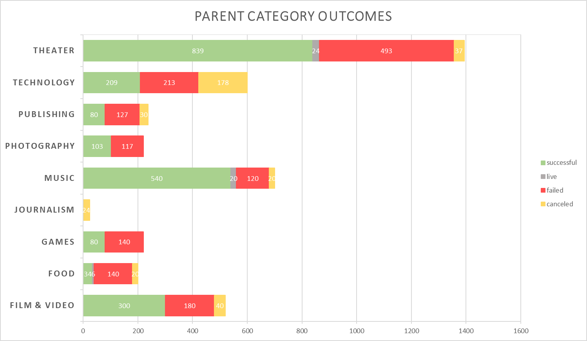
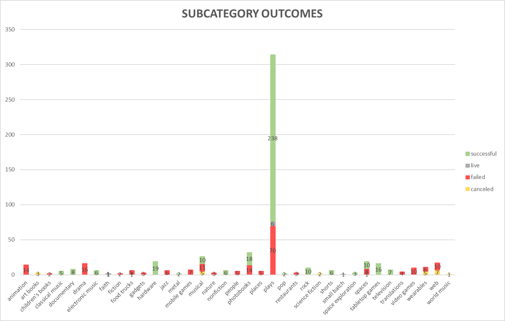
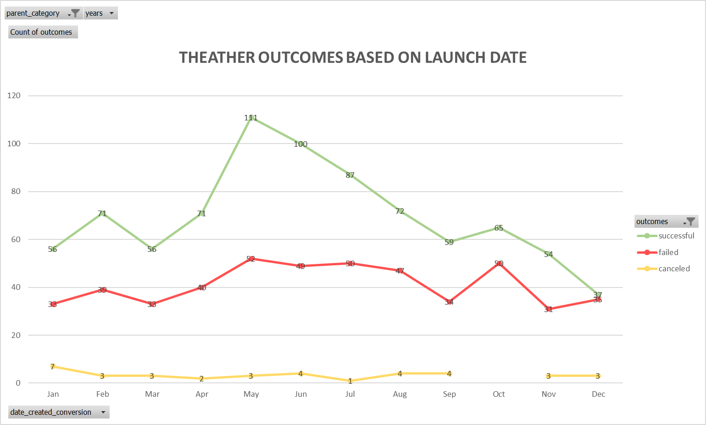
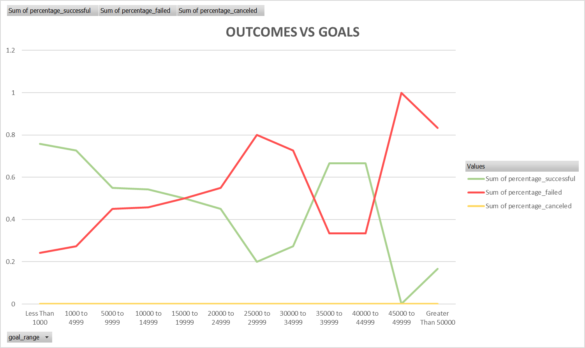

<link href="https://unpkg.com/tailwindcss@1.5.2/dist/tailwind.min.css" rel="stylesheet">

# Kickstarting Analysis with Excel

> Performing analysis on Kickstarter data to uncover trends.

## Overview of Project

Import the supplied Kickstarter data of 4000 rows of crowdfunding data to answer and assist in Louise in her decision making with "kick starting" her play fund.

Understanding [Kickstarter](https://www.kickstarter.com/about)

### Purpose

Up and coming play write Louise writing her play "Fever" on a \$10,000 budget.

She is hesitant for her first - are there specific factors that would make her successful. Use thes insights for success, by gaining understanding of the campaign to start to finish and mirroring campaigns to the successful plays.

into a table for analysis.
Apply filters, conditional formatting, and formulas.
Generate and interpret pivot tables.
Calculate summary statistics such as measures of central tendency, standard deviation, and variance.
Characterize data to identify outliers in datasets.
Perform an Excel analysis with visualizations.

## Analysis and Challenges

When Louise first came to us that she wanted to data backing her strategy in lunching a campaign. The first thing we did was not consult on the play itself but researched Kickstarter, and on there About us page, "Kickstarter campaigns make ideas into reality. It’s where creators share new visions for creative work with the communities that will come together to fund them." Understanding that Kickstarter campaigns share new visions of work with communities.

Getting funded on Kickstarter requires meeting or exceeding the project's initial goal, so many organizations spend months looking through past projects in an attempt to discover some trick for finding success. For this week's homework, you will organize and analyze a database of 4,000 past projects in order to uncover any hidden trends.

### Analysis of Outcomes Based on Launch Date

### Analysis of Outcomes Based on Goals

### Challenges and Difficulties Encountered

## Results

- What are two conclusions you can draw about the Outcomes based on Launch Date?

- What can you conclude about the Outcomes based on Goals?

- What are some limitations of this dataset?

- What are some other possible tables and/or graphs that we could create?
