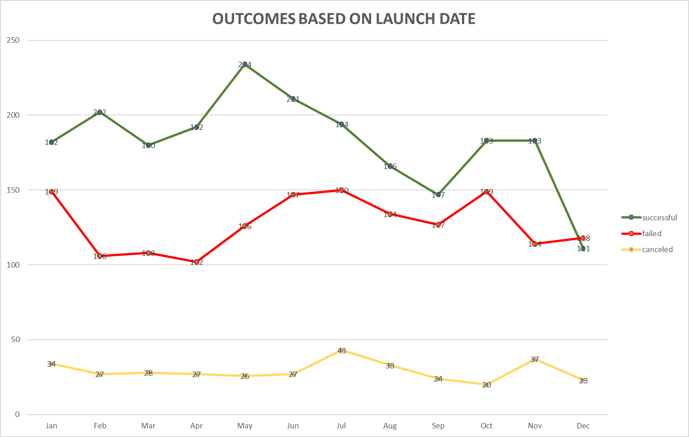

# Kickstarting Analysis with Excel

> Performing analysis on Kickstarter data to uncover trends.

## Table of Contents

- [Overview of Project](#overview-of-project)
- [Summary](#summary)
- [Analysis and Challenges](#analysis-and-challenges)
  - [Analysis of Outcomes Based on Launch Date](#analysis-of-outcomes-based-on-launch-date)
  - [Analysis of Outcomes Based on Goals](#analysis-of-outcomes-based-on-goals)
  - [Challenges and Difficulties Encountered](#challenges-and-difficulties-encountered)
- [Results](#results)
- [Todo Checklist](#todo-checklist)
- [Contributing](#contributing)
- [License](#license)

## Overview of Project

Supplied Kickstarter data of 4000 rows of crowdfunding data to answer and assist in Louise in her decision making with "kick starting" her play fund.

## Summary

Up and coming play write Louise writing her play "Fever" on a \$12,000 budget approached us for our Excel Data Analysis skills for one single purpose of GAINING INSIGHTS FOR SUCCESS by:

- Understanding of the successful campaigns from start to finish.
- Data to mirror the successful play campaigns.

Imagine the excitement of brain storming, entering a state of flow, and working out a piece of work you are excited and passionate for. You have this vision, you've been working it out with friends and they love the idea so decide to that plunge to head over to Kickstarter and try to make your art to reality.

Louise felt hesitant for her first first kickstarter, as we would all. Just as we imagined that excitement to make our art to reality, Louise is throwing out our her vision of a play. And she came to us with 4000 rows of data to gain insights for her play "Fever" a success.

There are specific factors that we could extract from the data that we could strategies to make Louise more than likely, successful in getting the \$12,000 funding. Using these insights for success, by gaining understanding of the success campaigns from start to finish and mirroring campaigns that were successful plays.

## Analysis and Challenges

We wanted to understand [Kickstarter](https://www.kickstarter.com/about) so before we took a look at the raw data (raw_kickstarter_data.csv) and from the about webpage, "Kickstarter campaigns is to make ideas into reality. It’s where creators share new visions for creative work with the communities that will come together to fund them." Understanding that Kickstarter campaigns share new visions of work with communities.

Opening up the raw data in Excel, seeing the columns available, the data types of the columns, and the information given to us. We also took a look at an example campaign [The Weight](https://www.kickstarter.com/projects/theweight/the-weight?ref=section-film-view-more-discovery-p1) to give us context of the columns, rows, and values.

### Example of 10 rows

| id  | name                                                         | blurb                                                                                                                                   | goal        | pledged     | outcomes   | country | currency | deadline   | launched_at | staff_pick | backers_count | spotlight | Category and Subcategory |
| --- | ------------------------------------------------------------ | --------------------------------------------------------------------------------------------------------------------------------------- | ----------- | ----------- | ---------- | ------- | -------- | ---------- | ----------- | ---------- | ------------- | --------- | ------------------------ |
| 0   | GIRLS STATE a new musical comedy TV project                  | In this new TV show "All Politics is Vocal" as high school girls campaign, sing and cheer to be elected Governor of their summer camp.  | \$8,500.00  | \$11,633.00 | successful | US      | USD      | 1437620400 | 1434931811  | FALSE      | 182           | TRUE      | film & video/television  |
| 1   | FannibalFest Fan Convention                                  | A Hannibal TV Show Fan Convention and Art Collective                                                                                    | \$10,275.00 | \$14,653.00 | successful | US      | USD      | 1488464683 | 1485872683  | FALSE      | 79            | TRUE      | film & video/television  |
| 2   | Charlie teaser completion                                    | Completion fund for post-production for teaser of British crime/drama tv series about a girl who sells morals for money                 | \$500.00    | \$525.00    | successful | GB      | GBP      | 1455555083 | 1454691083  | FALSE      | 35            | TRUE      | film & video/television  |
| 3   | Unsure/Positive: A Dramedy Series About Life with HIV        | We already produced the _very_ beginning of this story. Help us to see it through?                                                      | \$10,000.00 | \$10,390.00 | successful | US      | USD      | 1407414107 | 1404822107  | FALSE      | 150           | TRUE      | film & video/television  |
| 4   | Party Monsters                                               | 19th century’s most notorious literary characters, out of step with the times, find comradery as roommates in modern day Los Angeles. | \$44,000.00 | \$54,116.28 | successful | US      | USD      | 1450555279 | 1447963279  | FALSE      | 284           | TRUE      | film & video/television  |
| 5   | Terry Matthews to be the NEXT star on the Network Television | The BBQ Daddy will be Filming the 1st episode of the Next Hit series to come to Network Television "Bailout My Cookout"                 | \$3,999.00  | \$4,390.00  | successful | US      | USD      | 1469770500 | 1468362207  | FALSE      | 47            | TRUE      | film & video/television  |
| 6   | POINT HOPE                                                   | The story of "Point Hope" will honor, respect, and share the beauty and traditions of the Alaska Natives in Point Hope, AK: the Inupiat | \$8,000.00  | \$8,519.00  | successful | US      | USD      | 1402710250 | 1401846250  | FALSE      | 58            | TRUE      | film & video/television  |
| 7   | Skin: Film Production By 14 Year Old Aniya Wolfe             | Secrets bond three unfortunate teens who are facing issues that are common among youth today. And for one, it becomes too much to bear. | \$9,000.00  | \$9,110.00  | successful | US      | USD      | 1467680867 | 1464224867  | FALSE      | 57            | TRUE      | film & video/television  |
| 8   | Sizzling in the Kitchen Flynn Style                          | Help us raise the funds to film our pilot episode!                                                                                      | \$3,500.00  | \$3,501.52  | successful | US      | USD      | 1460754000 | 1460155212  | FALSE      | 12            | TRUE      | film & video/television  |
| 9   | The Academy: Mockumentary Sitcom TV Pilot                    | Capturing everyday life at Falkirk Academy, a fictitious elite private high school where "everyday life" is anything but normal.        | \$500.00    | \$629.99    | successful | US      | USD      | 1460860144 | 1458268144  | FALSE      | 20            | TRUE      | film & video/television  |
| 10  | Big in Beijing. A reality tv show about eccentric Beijing.   | Making a reality show casting the real elites of China. They are fun, young, wild, and ambitious. Filmed in Beijing with real risks.    | \$3,000.00  | \$3,015.00  | successful | US      | USD      | 1403660279 | 1400636279  | FALSE      | 19            | TRUE      | film & video/television  |

### Working with the values in context

- Campaigns have to exceed a certain monetary goal (this project's goal is \$12,000).
- Campaigns are in several categories (Louise is making a Play).
- **Campaigns have launch dates and datelines (this is one decision Louise will have to make).**
- Campaigns have outcomes (we can't control but predict).

How could we organize and analyze a database of 4,000 past projects in order to uncover trends to help in the decision on when to launch?

### Analysis of Outcomes Based on Launch Date

Below is a graph showing the _Outcomes Based on Launch Date_ for the total available data. We noticed that the total amount of each outcome (success, failed, canceled) for each month. The graph shows that May had the highest number of successes and December had the lowest amount of successes; December's success number is the month that even dipped below the number of failed campaigns. The line graph represents all parent categories and not narrowly focused on the subcategory of plays.

We wanted to narrow down the to the subcategories and tally the total amount of outcomes for each month. The graphs shows highers percentages of success rates compared to the entire sample size. We also get the same trend of May having the highest number of successes and December having the lowest amount of successes.

### Analysis of Outcomes Based on Goals

Louise budgeted that the play would cost a little over $10,000 ($12,000).

| Fever Budget | |
| --------------- | |
| Sets | $2,432.00 |
| Costumes        | $1,275.00 |
| Props | $1,347.00 |
| Makeup          | $452.00 |
| Lighting | $750.00 |
| Rehearsal Space | $1250.00 |
| Advertising | $725.00 |
| Programs        | $230.00 |
| Actors | $2,232.00 |
|                 |           |
| Total           | $10,000+ |
| | |
| | |

The graph shows that from the sample Louise would likely (54%) fall into the success bin; that is in a vacuum based on outcome by goal.

### Challenges and Difficulties Encountered

I went through two challenges and difficulties:

- Context & knowledge of the domain (more to than the trends)
- Testing the sample towards the population Data
  - [Kickstarter Stats](https://www.kickstarter.com/help/stats)
- Time to report
  - I could played and really dug deep on some of the pivot tables but I wanted to meet the analysis time requirements.

## Results

- What are two conclusions you can draw about the Outcomes based on Launch Date?

> With the provided data, apply filters, conditional formatting, and formulas to clean up the data. Generating and then further percentage computations with pivot tables to form and reshape some assumptions of the data. Calculating summary statistics, characterizing data to identify outliers, and finishing with analysis using charts and graphs. We would suggest Louise to launch her campaign in the month of May or June because of the success percentage rate from all categories and the percentage rate from the plays category.

- What can you conclude about the Outcomes based on Goals?

> Outcomes based on the monetary goal of 10k to 12k is not as opportunistic as lunching in May or June. With the analysis we've did on the data and narrowing down to different goal buckets (Less than $1000, 1001 to 4999, 5000 to 9999, etc.) The line graph shows that there is a 50/50 chance when it comes from the outcomes based on the goal so we would suggest to Louise to try and budget the play under $10,000.

- What are some limitations of this dataset?

> On Kickstarter's about webpage they mentioned under community one line that got me thinking, "Tapping into our community starts with activating your own." I would like to really know the size or reach of the successful campaigns following. What is the relationship of the size of a campaign's community and the campaign's outcome.

- What are some other possible tables and/or graphs that we could create?

> I would dig deeper in the pivot tables we made, work out more of the cross category percentages since we've only worked with the count number of values in the columns.

## Todo Checklist

A helpful checklist to gauge how your README is coming on what I would like to finish:

- [ ] Go Back to the data set
- [ ] Finish the questions of analysis
- [ ] Really think of the questions of analysis
- [ ] How to Manage and Release Excel files on GitHub: A Primer (Part I): https://www.xltrail.com/blog/how-to-manage-and-release-excel-files-on-github-part1

## Contributing

Pull requests are welcome. For major changes, please open an issue first to discuss what you would like to change.

Please make sure to update tests as appropriate.

## License

[MIT](https://choosealicense.com/licenses/mit/)
